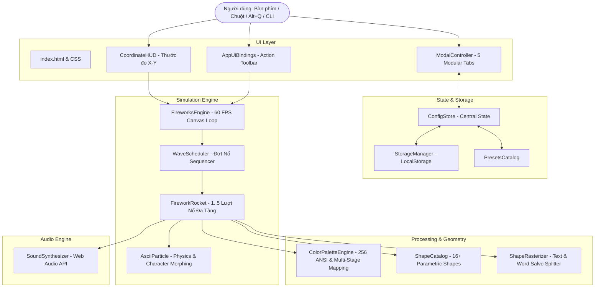

# Kiến Trúc Hệ Thống (System Architecture v3.0)

Tài liệu chi tiết về kiến trúc luồng dữ liệu, các module và cơ chế xử lý của hệ thống **Terminal ASCII Fireworks v3.0**.

---

## 🏛 1. Sơ đồ Kiến trúc Tổng thể

---

## 🧩 2. Danh mục Module & Nhiệm vụ

| Module | Tệp nguồn | Trách nhiệm chính |
|---|---|---|
| **Color Engine** | `js/color-palette-engine.js` | Tạo bảng 256 màu ANSI, phối màu từng lượt nổ (Stage 1..5) và màu hỗn hợp |
| **Shape Engine** | `js/shape-catalog.js`, `shape-catalog-basic.js`, `shape-catalog-exotic.js` | 16+ công thức toán học hình dạng (Cầu, Tim, Sao, Bướm, Vành đai, Vô cực...) |
| **Text Splitter** | `js/text-rasterizer.js` | Chuyển văn bản thành hạt ASCII và tách cụm từ thành chuỗi tên lửa theo trục X |
| **Coordinate HUD** | `js/coordinate-hud.js` | Vẽ vạch chia trục X (0-100%), trục Y và tọa độ live của con trỏ chuột |
| **Storage Manager** | `js/storage-manager.js` | Tự động ghi nhớ cấu hình vào LocalStorage và quản lý khe lưu |
| **Rocket Controller**| `js/firework.js` | Quản lý vòng đời tên lửa, hỗ trợ nổ liên hoàn tối đa 5 lượt đa tầng |
| **Wave Scheduler** | `js/wave-scheduler.js` | Điều phối thứ tự, độ trễ và tọa độ X/Y của từng đợt bắn |
| **Modal Controller**| `js/modal-controller.js`, `modal-tab-renderer.js`, `modal-sync-helper.js` | Quản lý giao diện tùy biến 5 tab chuyên sâu |
| **Sound Synthesizer**| `js/audio.js` | Bộ tổng hợp âm thanh Web Audio API thời gian thực |
